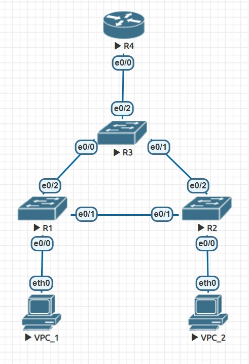
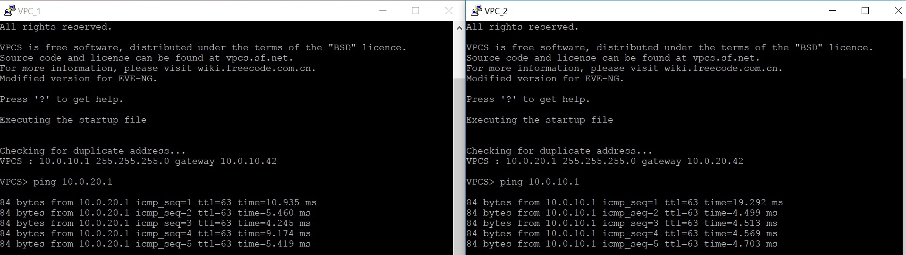
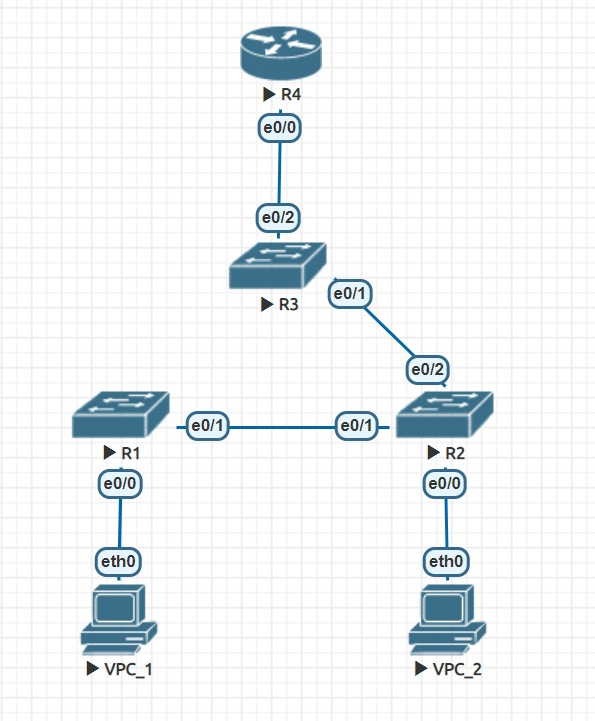
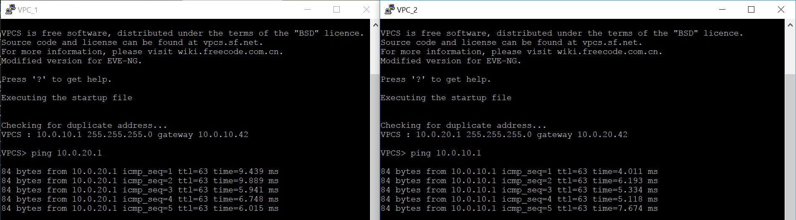

# Homework 1

Далее находится описание первой самостоятельной работы. Сначала показана настройка сети, далее приведены примеры использования и проверка работоспособности. Конфиги и лабораторная работа загружены в данную дирректорию.



## Краткая структура сети

В сети настроен протокол STP. Коммутатор уровня распределения (R3) является корнем, линк между коммутаторами уровня доступа (R1 и R2) заблокирован. К R1 и к R2 подключены конечные пользователи. С маршрутизатором (R4) связан коммутатор уровня распределения (R3). Каждый клиент находится в своем VLAN (Client1 (VPC_1) находится в VLAN 10 и сети 10.0.10.0/42, Client2 (VPC_2) находится в VLAN 10 и сети 10.0.20.0/42). 

## Настройка сети

1) R1 (Switch)

```

Switch(config)#vlan 10,20
Switch(config-vlan)#exit
Switch(config)#vtp mode off
Switch(config)#vtp domain off
Switch(config)#spanning-tree vlan 10,20 priority 8192
Switch(config)#interface e0/0
Switch(config-if)#switchport mode access
Switch(config-if)#switchport access vlan 10
Switch(config-if)#exit
Switch(config)#interface e0/1
Switch(config-if)#switchport trunk encapsulation dot1q
Switch(config-if)#switchport mode trunk
Switch(config-if)#switchport trunk allowed vlan 10,20
Switch(config-if)#exit
Switch(config)#interface e0/2
Switch(config-if)#switchport trunk encapsulation dot1q
Switch(config-if)#switchport mode trunk
Switch(config-if)#switchport trunk allowed vlan 10,20
Switch(config-if)#exit
Switch(config)#exit

```

2) R2 (Switch)

```

Switch(config)#vlan 10,20
Switch(config-vlan)#exit
Switch(config)#vtp mode off
Switch(config)#vtp domain off
Switch(config)#interface e0/0
Switch(config-if)#switchport mode access
Switch(config-if)#switchport access vlan 20
Switch(config-if)#exit
Switch(config)#interface e0/1
Switch(config-if)#switchport trunk encapsulation dot1q
Switch(config-if)#switchport mode trunk
Switch(config-if)#switchport trunk allowed vlan 10,20
Switch(config-if)#exit
Switch(config)#interface e0/2
Switch(config-if)#switchport trunk encapsulation dot1q
Switch(config-if)#switchport mode trunk
Switch(config-if)#switchport trunk allowed vlan 10,20
Switch(config-if)#exit
Switch(config)#exit

```
3) R3 (Switch)

```

Switch(config)#vlan 10,20
Switch(config-vlan)#exit
Switch(config)#vtp mode off
Switch(config)#vtp domain off
Switch(config)#spanning-tree vlan 10,20 priority 4096
Switch(config)#interface e0/0
Switch(config-if)#switchport trunk encapsulation dot1q
Switch(config-if)#switchport mode trunk
Switch(config-if)#switchport trunk allowed vlan 10,20
Switch(config-if)#exit
Switch(config)#interface e0/1
Switch(config-if)#switchport trunk encapsulation dot1q
Switch(config-if)#switchport mode trunk
Switch(config-if)#switchport trunk allowed vlan 10,20
Switch(config-if)#exit
Switch(config)#interface e0/2
Switch(config-if)#switchport trunk encapsulation dot1q
Switch(config-if)#switchport mode trunk
Switch(config-if)#switchport trunk allowed vlan 10,20
Switch(config-if)#exit
Switch(config)#exit

```

4) R4 (Router)
```

Router(config)#interface e0/0
Router(config-if)#no shutdown
Router(config-if)#exit
Router(config)#interface e0/0
Router(config)#interface e0/0.10
Router(config-subif)#encapsulation dot1Q 10
Router(config-subif)#ip address 10.0.10.42 255.255.255.0
Router(config-subif)#exit
Router(config)#interface e0/0.20
Router(config-subif)#encapsulation dot1Q 20
Router(config-subif)#ip address 10.0.20.42 255.255.255.0
Router(config-subif)#exit

```

5) VPC-1

```
ip 10.0.10.1 255.255.255.0 10.0.10.42

```

6) VPC-2

```
ip 10.0.20.1 255.255.255.0 10.0.20.42

```

## Проверка работоспособности

### Первый случай




### Второй случай





