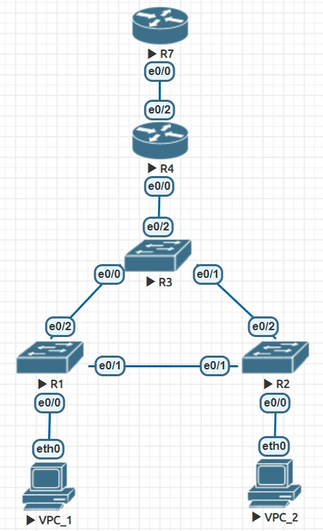
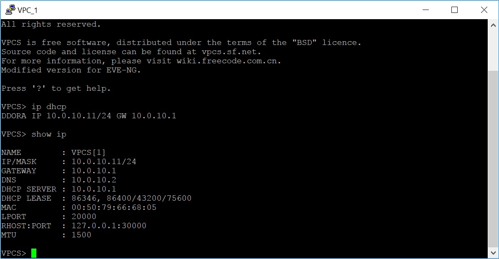
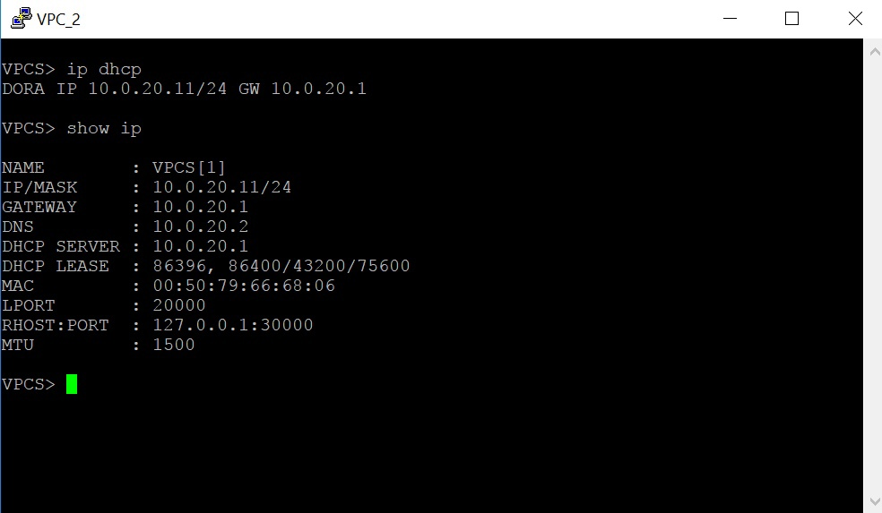
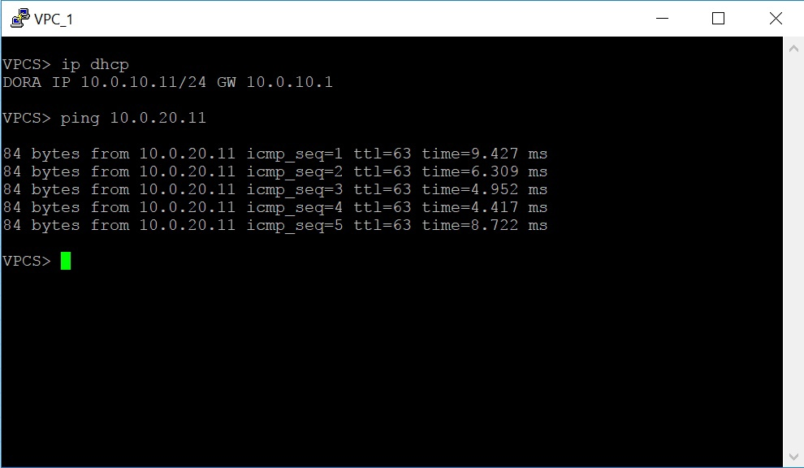
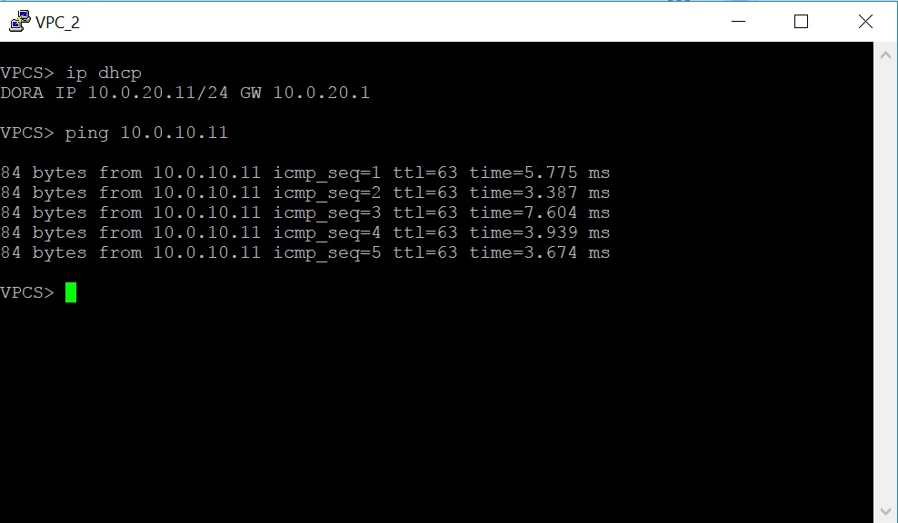
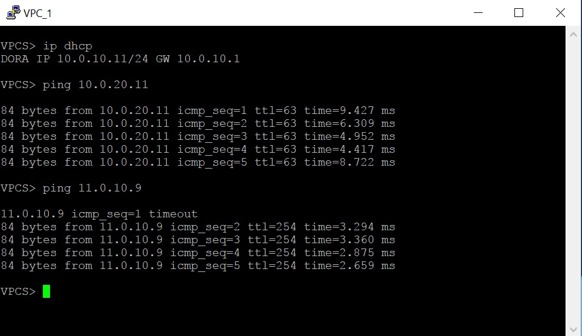
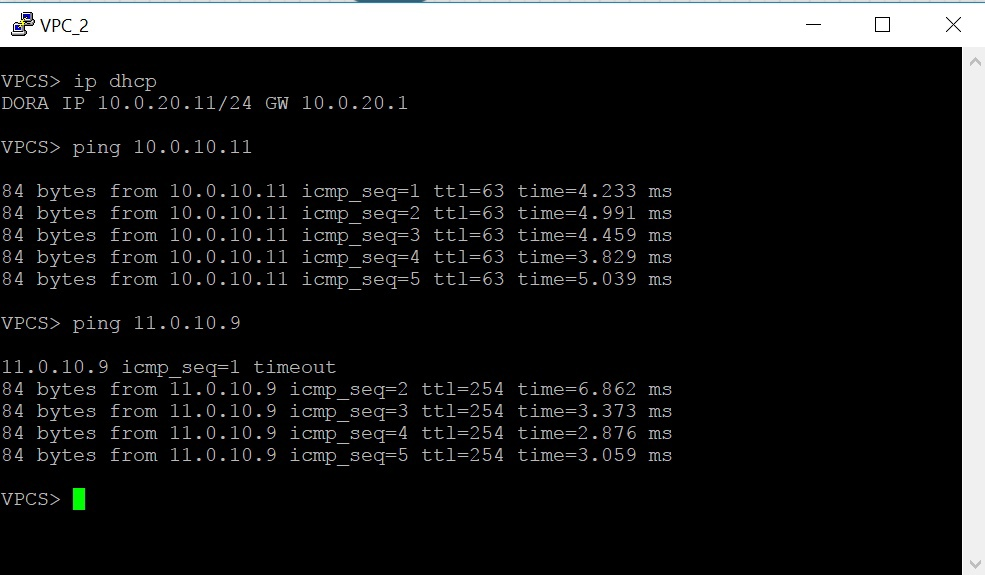

# Homework 3

Далее находится описание третей самостоятельной работы. Сначала показана настройка сети, далее приведены примеры использования и проверка работоспособности. Конфиги и лабораторная работа загружены в данную дирректорию.



## Краткая структура сети

Продолжение первой самостоятельной. Проделанные в ней настройке описаны ранее. Для данной самостоятельной настроен DHCP и NAT. Клиенты получают все необходимые настройки через DHCP. В настройках DHCP сервера исключены первые 10 IP адресов из выдачи. NAT работает для клиентов, даже если их число превышает десять. Клиенты могут обращаться к верхнему маршрутизатору (R7), причем только с помощью NAT (то есть для него настроен интерфейс как на аутсайд).

## Настройка сети

1) R1 (Switch)

```

Switch(config)#vlan 10,20
Switch(config-vlan)#exit
Switch(config)#vtp mode off
Switch(config)#vtp domain off
Switch(config)#spanning-tree vlan 10,20 priority 8192
Switch(config)#interface e0/0
Switch(config-if)#switchport mode access
Switch(config-if)#switchport access vlan 10
Switch(config-if)#exit
Switch(config)#interface e0/1
Switch(config-if)#switchport trunk encapsulation dot1q
Switch(config-if)#switchport mode trunk
Switch(config-if)#switchport trunk allowed vlan 10,20
Switch(config-if)#exit
Switch(config)#interface e0/2
Switch(config-if)#switchport trunk encapsulation dot1q
Switch(config-if)#switchport mode trunk
Switch(config-if)#switchport trunk allowed vlan 10,20
Switch(config-if)#exit
Switch(config)#exit

```

2) R2 (Switch)

```

Switch(config)#vlan 10,20
Switch(config-vlan)#exit
Switch(config)#vtp mode off
Switch(config)#vtp domain off
Switch(config)#interface e0/0
Switch(config-if)#switchport mode access
Switch(config-if)#switchport access vlan 20
Switch(config-if)#exit
Switch(config)#interface e0/1
Switch(config-if)#switchport trunk encapsulation dot1q
Switch(config-if)#switchport mode trunk
Switch(config-if)#switchport trunk allowed vlan 10,20
Switch(config-if)#exit
Switch(config)#interface e0/2
Switch(config-if)#switchport trunk encapsulation dot1q
Switch(config-if)#switchport mode trunk
Switch(config-if)#switchport trunk allowed vlan 10,20
Switch(config-if)#exit
Switch(config)#exit

```
3) R3 (Switch)

```

Switch(config)#vlan 10,20
Switch(config-vlan)#exit
Switch(config)#vtp mode off
Switch(config)#vtp domain off
Switch(config)#spanning-tree vlan 10,20 priority 4096
Switch(config)#interface e0/0
Switch(config-if)#switchport trunk encapsulation dot1q
Switch(config-if)#switchport mode trunk
Switch(config-if)#switchport trunk allowed vlan 10,20
Switch(config-if)#exit
Switch(config)#interface e0/1
Switch(config-if)#switchport trunk encapsulation dot1q
Switch(config-if)#switchport mode trunk
Switch(config-if)#switchport trunk allowed vlan 10,20
Switch(config-if)#exit
Switch(config)#interface e0/2
Switch(config-if)#switchport trunk encapsulation dot1q
Switch(config-if)#switchport mode trunk
Switch(config-if)#switchport trunk allowed vlan 10,20
Switch(config-if)#exit
Switch(config)#exit

```

4) R4 (Router)

```

Router(config)#interface e0/0
Router(config-if)#no shutdown
Router(config-if)#exit
Router(config)#interface e0/0
Router(config)#interface e0/0.10
Router(config-subif)#encapsulation dot1Q 10
Router(config-subif)#ip address 10.0.10.1 255.255.255.0
Router(config-subif)#exit
Router(config)#interface e0/0.20
Router(config-subif)#encapsulation dot1Q 20
Router(config-subif)#ip address 10.0.20.1 255.255.255.0
Router(config-subif)#exit
Router(config)#int e0/0.10
Router(config-subif)#ip dhcp pool VLAN10POOL
Router(dhcp-config)#network 10.0.10.0 255.255.255.0
Router(dhcp-config)#default-router 10.0.10.1
Router(dhcp-config)#dns-server 10.0.10.2
Router(dhcp-config)#exit
Router(config)#ip dhcp excluded-address 10.0.10.1 10.0.10.10
Router(config)#int e0/0.20
Router(config-subif)#ip dhcp pool VLAN20POOL
Router(dhcp-config)#network 10.0.20.0 255.255.255.0
Router(dhcp-config)#default-router 10.0.20.1
Router(dhcp-config)#dns-server 10.0.20.2
Router(dhcp-config)#exit
Router(config)#ip dhcp excluded-address 10.0.20.1 10.0.20.10
Router(config)#access-list 100 permit ip 10.0.10.0 0.0.0.255 any
Router(config)#access-list 100 permit ip 10.0.20.0 0.0.0.255 any
Router(config)#in e0/2
Router(config-if)#no shutdown
Router(config-if)#ip address 11.0.10.1 255.255.255.0
Router(config-if)#ip nat outside
Router(config-if)#exit
Router(config)#int e0/0
Router(config-if)#ip nat inside
Router(config-if)#exit
Router(config)#int e0/0.10
Router(config-subif)#ip nat inside
Router(config-subif)#exit
Router(config)#int e0/0.20
Router(config-subif)#ip nat inside
Router(config-subif)#exit
Router(config)#ip nat inside source list 100 int e0/2 overload
Router(config)#exit

```

5) R5 (Router)

```

Router(config)#interface e0/0
Router(config-if)#no shutdown
Router(config-if)#ip address 11.0.10.9 255.255.255.0
Router(config-if)#exit

```


## Проверка работоспособности

### Получаем на клиентах сетевые настройки с помощью DHCP





### Общение клиентов между собой





### Общение клиентов с верхним маршрутизатором




