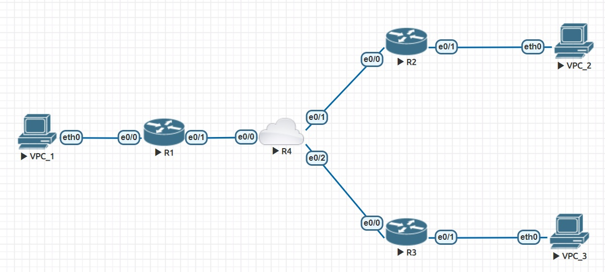

# Homework 4

Далее находится описание четвертой самостоятельной работы. Сначала показана настройка сети, далее приведены примеры использования и проверка работоспособности. Конфиги и лабораторная работа загружены в данную дирректорию.



## Краткая структура сети


## Настройка сети

1) R1 (Router)

```


```

2) R2 (Router)

```


```
3) R3 (Router)

```


```

4) R4 (Router)

```


```


## Проверка работоспособности

